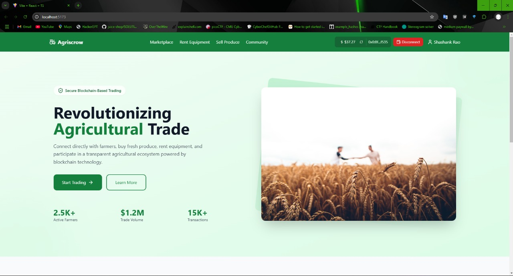

# Agriscrow - Decentralized Agricultural Marketplace

Agriscrow is a blockchain-powered platform that connects farmers, buyers, and equipment owners in a secure and transparent agricultural ecosystem. Built on the TON blockchain, it enables direct trading, equipment rental, and secure transactions through smart contracts.



## Features

- **Secure Escrow System**: Smart contract-based escrow system for secure transactions
- **TON Integration**: Native cryptocurrency payments using TON
- **Multi-User Roles**: Support for farmers, buyers, landlords, and renters
- **Equipment Rental**: Platform for agricultural equipment rental
- **Community Features**: Discussion forums and knowledge sharing
- **Real-time Updates**: Live transaction and market data
- **Responsive Design**: Mobile-first interface built with Tailwind CSS
- **FCFS**: First Come, First Served order processing for fair marketplace transactions in rentals

## Tech Stack

### Frontend
- React 18 with TypeScript
- Vite for build tooling
- Tailwind CSS for styling
- TON Connect for wallet integration
- Lucide React for icons
- ESLint for code quality

### Backend
- Flask (Python)
- SQLite database
- Flask-CORS for cross-origin support
- Werkzeug for security features

### Smart Contracts
- TON Blockchain
- TON Core SDK
- Tact for smart contract development

## Project Structure

```
├── Frontend/
│   ├── src/
│   │   ├── components/
│   │   │   ├── auth/           # Authentication components
│   │   │   ├── community/      # Community and forum features
│   │   │   ├── dashboard/      # User dashboards
│   │   │   ├── equipment/      # Equipment rental
│   │   │   ├── home/          # Landing page components
│   │   │   ├── layout/        # Common layout components
│   │   │   ├── marketplace/   # Product listing and trading
│   │   │   └── wallet/        # Wallet integration
│   │   ├── services/          # API and blockchain services
│   │   ├── providers/         # Context providers
│   │   └── hooks/            # Custom React hooks
│   └── public/
├── backend/
│   ├── app.py                # Main Flask application
│   └── uploads/              # File uploads directory
└── contracts/
    └── escrow/              # Smart contract code
```

## Getting Started

### Prerequisites
- Node.js (v16 or higher)
- Python 3.8+
- TON Wallet (e.g., TonKeeper)
- Git

### Installation

1. Clone the repository:
```bash
git clone https://github.com/0x5h31d0n/Agriscrow-TON.git
cd Agriscrow-TON
```

2. Install Frontend dependencies:
```bash
cd Frontend
npm install
```

3. Install Backend dependencies:
```bash
cd backend
pip install -r requirements.txt
```

4. Start the development servers:

Frontend:
```bash
cd Frontend
npm run dev
```

Backend:
```bash
cd backend
flask run
```

## Key Components

### Smart Contract Integration
- Escrow service for secure transactions
- Multi-signature requirements
- Timelock mechanisms
- Dispute resolution system

### User Roles

1. **Farmers**
   - List agricultural products
   - Rent equipment
   - Manage sales

2. **Buyers**
   - Purchase products
   - Track orders
   - Manage transactions

3. **Landlords**
   - List equipment for rent
   - Manage rental agreements
   - Track revenue

4. **Renters**
   - Rent agricultural equipment
   - Schedule rentals
   - Track usage

## Development

### Frontend Development
```bash
cd Frontend
npm run dev        # Start development server
npm run build      # Build for production
npm run lint       # Run ESLint
```

### Backend Development
```bash
cd backend
flask run --debug  # Start development server with debug mode
```

### Smart Contract Development
- Deploy contracts using TON CLI
- Test using TON test network
- Use TON Sandbox for local development

## Testing

```bash
# Frontend tests
cd Frontend
npm run test

# Backend tests
cd backend
python -m pytest
```

## Deployment

### Frontend Deployment
1. Build the frontend:
```bash
cd Frontend
npm run build
```

2. Deploy the `dist` directory to your web server

### Backend Deployment
1. Set up a production server (e.g., nginx + gunicorn)
2. Configure environment variables for production
3. Deploy using your preferred deployment method

## Code Style

- Frontend follows TypeScript and ESLint standards
- Backend follows PEP 8 guidelines
- Use Prettier for JavaScript/TypeScript formatting
- Follow conventional commits specification

## Security

- Smart contract auditing required before production
- Regular security updates
- Input validation on both frontend and backend
- Secure wallet integration

## Contact

Project Link: [https://github.com/0x5h31d0n/Agriscrow-TON](https://github.com/0x5h31d0n/Agriscrow-TON)

## Acknowledgments

- TON Society India
- TonConnect team
- All open-source libraries used in this project

---

Made with ❤️ by Scriptators